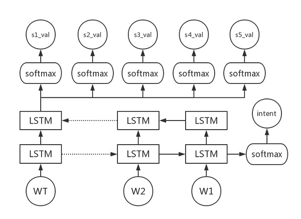

# Joint model for spoken language understanding (slot filling & intent detection)

## Setup

* Tensorflow 1.0
* Python 3.6

## Model

Hierarchical LSTM model

**slot_filling**: sequence classification (fixed slot value)

**intent_filling**: sequence classification

> Note: slots and intent don't have the "_UNK" value
> three intents: inform, confirm, reject

## File

| file          | notes                |
| ------------- | -------------------- |
| nlu_interface | 供其他模块调用的接口 |
| nlu_tylh      | 模型训练代码         |
| nlu_yzf       | 模型训练代码         |

## References

- Wen L, Wang X, Dong Z, et al. [Jointly Modeling Intent Identification and Slot Filling with Contextual and Hierarchical Information](http://tcci.ccf.org.cn/conference/2017/papers/1093.pdf)[J]. 2017.