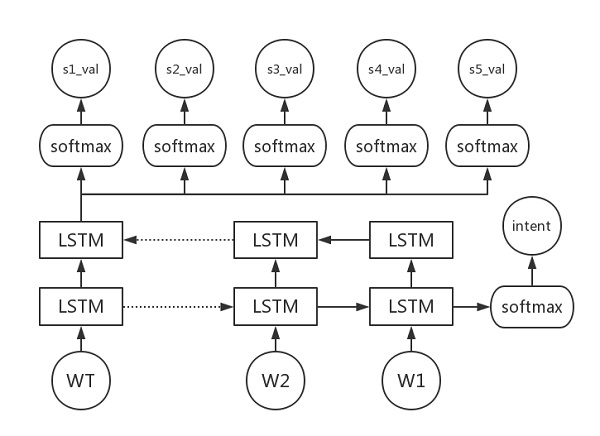

# Joint model for spoken language understanding (slot filling & intent detection)

joint-nlu for zte yizhifu

## Setup

* Tensorflow  1.0
* Python 3.6

## Model

Hierarchical LSTM model

**slot_filling**: sequence classification (fixed slot value)

**intent_filling**: sequence classification

> Note: slots and intent don't have the "_UNK" value
>
> three intents: inform, confirm, reject
>
> This version contain raw yizhifu FAQ data.

## Code and Dataset

| file                | notes                                                        |
| ------------------- | ------------------------------------------------------------ |
| generate_data.py    | 数据预处理，将原始数据（/raw文件夹下的文件）处理成句子与标签分开的文件（/data） |
| data_utils.py       | 包括一些处理数据的函数，用于数据处理成模型所需的数据格式 |
| multi_task_model.py | 定义了一个类MultiTaskModel，包括step(), get_batch(), get_one()等用于模型训练的方法 |
| run_multi_task.py   | 完成LSTM模型的建模，train()函数用于训练模型 |
| nlu.py              | 定义了NLU与其他模块的接口，包括用于加载已经训练好的模型的函数: load_nlu_model()以及接口函数nlu_interface() |
| /raw                | 原始数据集 |
| /data               | 预处理后的数据集，以及模型训练过程中生成的词典文件 |
| /model              | 训练好的NLU模型  |

## Vocabulary

intent and slot value set

| intent              | attr                                                         | loc                                  | name                                                         | ope                                                          | way                                                     |
| ------------------- | ------------------------------------------------------------ | ------------------------------------ | ------------------------------------------------------------ | ------------------------------------------------------------ | ------------------------------------------------------- |
| confirm,inform, reject | NULL,交易记录,余额,初始密码,初始支付密码,历史交易记录,提现记录,,付密码,登录密码,账单,返利明细 | NULL,上海,北京,柳州,武汉,河池,玉林,贺州,防港 | NULL,“翼起看电影”之10元看大片,“翼起看电影”之“甜蜜二人行，一人免单”,世界杯最后的疯狂,世界杯，翼起来淘金,多买多送,五一火车票营销,充话费、缴水电煤9折,加油优惠,商超返利促销,寻找身边的翼支付，全国手机摄影大赛,小翼疯狂猜图,巅峰对决，翼起竞猜,微信互动游戏,支付正爽周三支付85折营销,新蛋电商联合营销,最红星期六,电影票免单,翼支付最红星期六，年末回馈八八折,话费充值98折 | NULL,交交通罚款,充值,加油,参加,开通,提现,支付,查询,注销,消费,缴话费,转账 | NULL,微信,手机客户端,短信,网银,翼支付网站,话费余额,银行卡|

## References

- Wen L, Wang X, Dong Z, et al. [Jointly Modeling Intent Identification and Slot Filling with Contextual and Hierarchical Information](http://tcci.ccf.org.cn/conference/2017/papers/1093.pdf)[J]. 2017.

